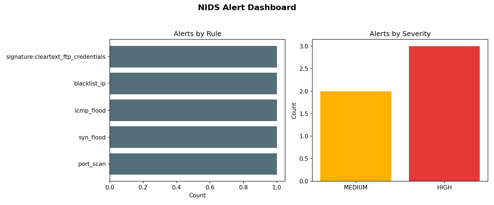

# 🚨 Task 4 — Network Intrusion Detection System (NIDS)

**CodeAlpha Cyber Security Internship**

A lightweight, rule-based Network Intrusion Detection System written in
Python. It sniffs live traffic (or replays a `.pcap`), evaluates every
packet against a stateful detection engine, and raises structured,
severity-tagged alerts in real time — both to the console and to a
JSON-Lines log file ready for downstream analysis or a SIEM.



---

## ✨ Features

- **Live packet capture** on any network interface via [Scapy](https://scapy.net/)
- **Offline `.pcap` replay** for safe, repeatable testing/demos
- **Stateful detection engine** with a sliding time window per source IP:
  - 🔍 **Port scan detection** — N distinct destination ports in a time window
  - 🌊 **SYN flood detection** — abnormal rate of bare SYN packets
  - 📡 **ICMP flood detection** — abnormal rate of ping/echo requests
  - 🚫 **IP blacklist matching** — flags known-bad source addresses
  - 🧬 **Payload signature matching** — regex rules for cleartext
    credentials, SQLi patterns, reverse-shell strings, etc.
- **Configurable thresholds and rules** via YAML — no code changes needed
  to tune for your environment
- **Cooldown logic** per rule/source so a sustained attack produces one
  clear alert stream instead of thousands of duplicates
- **Structured JSON-Lines alert log** + color-coded console output
- **Built-in dashboard generator** (`visualize_alerts.py`) that turns the
  alert log into a two-panel chart (by rule / by severity)
- **11 automated unit tests** covering every detector, with zero
  dependency on root access or a live interface

## 📂 Project Structure

```
Task_4_Network_Intrusion_Detection_System/
├── nids/
│   ├── sniffer.py      # Live capture + pcap replay, Scapy -> PacketEvent bridge
│   ├── detectors.py     # Stateful detection engine (port scan, floods, signatures, blacklist)
│   ├── rules.py          # Loads thresholds/blacklist/signatures from YAML
│   ├── alert.py           # Structured alert model + console/file logging
│   └── main.py             # CLI entrypoint (--demo / --pcap / --iface)
├── rules/rules.yaml        # Detection thresholds, blacklist, payload signatures
├── config.yaml              # Runtime configuration
├── tests/test_detectors.py  # 11 unit tests for the detection engine
├── visualize_alerts.py       # Alert log -> dashboard PNG
├── sample_output/
│   ├── sample_alerts.log      # Real output from a demo run
│   └── alert_dashboard.png     # Generated from the sample log above
└── requirements.txt
```

## 🚀 Quick Start

```bash
pip install -r requirements.txt

# 1) See it work immediately with synthetic attack traffic (no root needed)
python -m nids.main --demo

# 2) Replay a real .pcap capture file offline
python -m nids.main --pcap path/to/capture.pcap

# 3) Live capture on a real interface (requires root/administrator)
sudo python -m nids.main --iface eth0

# Generate the alert dashboard from whatever you just ran
python visualize_alerts.py --log logs/alerts.log
```

### Demo mode output (real run)

```
[MEDIUM  ] ... port_scan             src=203.0.113.66 -> 10.0.0.5   15 distinct ports probed in 10s (threshold=15)
[HIGH    ] ... syn_flood             src=203.0.113.66 -> 10.0.0.5:80  100 SYN packets in 5s (threshold=100) — possible SYN flood
[MEDIUM  ] ... icmp_flood            src=203.0.113.66 -> 10.0.0.5   50 ICMP echo requests in 5s (threshold=50) — possible ping flood
[HIGH    ] ... blacklist_ip          src=198.51.100.23 -> 10.0.0.5:22  Traffic from blacklisted IP
[HIGH    ] ... signature:cleartext_ftp_credentials  src=192.0.2.15 -> 10.0.0.5:21  Payload matched signature
```

Full log: [`sample_output/sample_alerts.log`](sample_output/sample_alerts.log)

## 🧪 Running the Tests

```bash
pip install pytest
python -m pytest tests/ -v
```

All 11 tests pass, covering true positives, true negatives (SYN+ACK,
ICMP replies, clean payloads), and sliding-window expiry behavior.

## ⚙️ Configuring Detection Rules

Edit [`rules/rules.yaml`](rules/rules.yaml) to tune thresholds, add
blacklisted IPs, or add new payload signatures — no code changes
required:

```yaml
thresholds:
  port_scan_unique_ports_threshold: 15
  syn_flood_threshold: 100

blacklist_ips:
  - 198.51.100.23

signatures:
  - name: cleartext_ftp_credentials
    pattern: "USER\\s+\\S+\\r?\\nPASS\\s+\\S+"
    severity: HIGH
```

## 🧠 Design Notes

- Detectors consume a protocol-agnostic `PacketEvent` rather than raw
  Scapy packets. This decouples detection *logic* from packet *capture*,
  which is what makes the entire engine unit-testable without root
  privileges, a live NIC, or a `.pcap` fixture.
- Each detector keeps a per-source-IP sliding-window `deque` of recent
  events and prunes anything older than its configured window on every
  packet — an O(1) amortized approach that scales to sustained traffic.
- A cooldown timer per `(rule, source)` pair prevents alert flooding
  during an ongoing attack while still logging every underlying packet.

## ⚠️ Responsible Use

This tool is for educational use and for monitoring networks you own or
are explicitly authorized to monitor. Live packet capture on a network
you do not control or lack authorization for may violate local law and
organizational policy.

## 🛠️ Tools & Libraries

- Python 3.11+
- [Scapy](https://scapy.net/) — packet capture and parsing
- PyYAML — rule/config loading
- Matplotlib — alert dashboard
- pytest — automated testing

---

*Part of the [CodeAlpha Cyber Security Internship](../README.md).*
